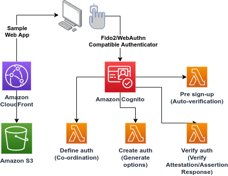
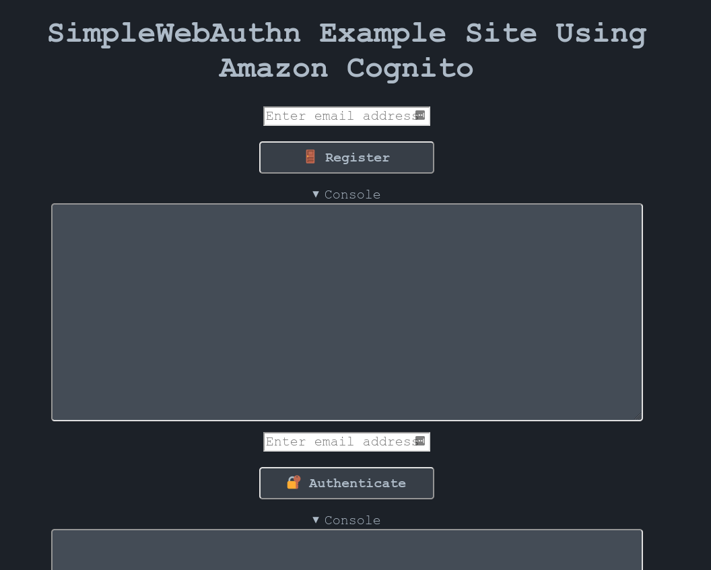

# cdk-serverless-cognito-fido2-webauthn

This CDK app is a proof of concept example implementation of the FIDO2/WebAuthn protocols for passwordless logins using Amazon Cognito as a "Relying Party" (authentication server).  This is made possible thanks to a couple existing technologies:

- [Amazon Cognito's Custom Authentication Challenge Lambda Triggers](https://docs.aws.amazon.com/cognito/latest/developerguide/user-pool-lambda-challenge.html)
- [SimpleWebAuthn](https://github.com/MasterKale/SimpleWebAuthn)

A demo deployment can be played with here: https://delzs89prk9ue.cloudfront.net/

## Architecture



## SimpleWebAuthn

Goal as part of implementing this sample code was to replicate the [example](https://simplewebauthn.dev/docs/advanced/example-project) provided by SimpleWebAuthn serverlessly using Amazon Cognito and CloudFront+S3 as opposed to a server-based Node.JS server.  Advantages:

- Faster/easier setup
- Automatically scalable
- Showing how to augment existing AWS authentication mechanisms (Amazon Cognito) to leverage Fido2/WebAuthn
- Passwordless login flow

## Requirements

- [AWS Account](https://aws.amazon.com/)
- [AWS CDK](https://aws.amazon.com/cdk/) (TypeScript)
- [Node/Npm](https://nodejs.org/)
- Fido2/WebAuthn compatible authenticator (ex. Yubikey)

## Deploy

### 1. Clone this repo and step into the created folder/directory

```
git clone https://github.com/aaronbrighton/cdk-serverless-cognito-fido2-webauthn.git
cd cdk-serverless-cognito-fido2-webauthn
```

### 2. Install dependencies

```
npm install
```

### 3. Deploy CDK app to AWS

```
npx cdk deploy
```

You should see deployed web app in the final output of the above command:

```
Outputs:
simplewebauthn-example-cognito.webappcloudfrontoutput = https://delzs89prk9ue.cloudfront.net/
```

## Usage



### 1. Enter an email address above the register button
### 2. Click register and activate your authenticator
### 3. Enter same email address above the authenticate button
### 4. Click authenticate and activate your authenticator
### Additional notes and limitations

- You can register multiple authenticators by hitting the register button again.
- Due to implementation and limitations of Amazon Cognito custom user fields lengths only 2 authenticators can be registered to a given email address at a time.


## Costs

Majority of proof of concept deployments of this code should fall under the [AWS Free Tier](https://aws.amazon.com/free/).